# DevSecOps Workshop - Microservices Pipeline

## 🎯 Project Overview

This workshop demonstrates a comprehensive **DevSecOps CI/CD pipeline** implementation focusing on security, automation, and monitoring. The project consists of two microservices:

* `user-service`: RESTful service for user management
* `product-service`: RESTful service for product catalog management

### 🛠 Technology Stack

#### CI/CD & Version Control
* **Jenkins**: Automated pipeline orchestration
* **GitHub**: Source code management and version control

#### Security Tools
* **Trivy**: Container and filesystem vulnerability scanning
* **Vault**: Secrets management and encryption
* **Nuclei**: Dynamic vulnerability scanner
* **SonarQube**: Code quality and security analysis

#### Containerization & Orchestration
* **Docker**: Application containerization
* **Kubernetes**: Container orchestration and scaling

#### Monitoring & Observability
* **Prometheus**: Metrics collection and alerting
* **Grafana**: Metrics visualization and dashboards

---

## 🏗 System Architecture

```mermaid
graph TB
    subgraph "Development"
        Dev["👨‍💻 Developer"] --> Git["📦 GitHub Repository"]
        Git --> Jenkins["🔄 Jenkins Pipeline"]
    end

    subgraph "Security Scanning"
        Jenkins --> |"Static Analysis"| Sonar["🔍 SonarQube"];
        Jenkins --> |"Container Scan"| Trivy["🛡️ Trivy Scanner"];
        Jenkins --> |"Dynamic Scan"| Nuclei["🎯 Nuclei Scanner"];
    end

    subgraph "Secrets & Security"
        Jenkins --> Vault["🔐 HashiCorp Vault"]
        Vault --> |"Inject Secrets"| K8s
    end

    subgraph "Container Pipeline"
        Jenkins --> |"Push Images"| DockerHub["🐳 Docker Hub"]
        DockerHub --> |"Pull Images"| K8s["☸️ Kubernetes Cluster"]
    end

    subgraph "Application Services"
        K8s --> UserSvc["👥 User Service"]
        K8s --> ProdSvc["📦 Product Service"]
    end

    subgraph "Monitoring & Observability"
        UserSvc --> Prom["📊 Prometheus"]
        ProdSvc --> Prom
        Prom --> Grafana["📈 Grafana Dashboards"]
    end

classDef primary fill:#f9f,stroke:#333,stroke-width:2px;
classDef secondary fill:#bbf,stroke:#333,stroke-width:2px;
classDef security fill:#ff9,stroke:#333,stroke-width:2px;

class Jenkins,K8s primary;
class Sonar,Trivy,Nuclei,Vault security;
class Prom,Grafana secondary;
```



### Pipeline Stages

1. **Code Commit & Review**
   - Source code pushed to GitHub
   - Automated code review triggers

2. **Security Scanning**
   - SonarQube: Code quality & SAST
   - Trivy: Container vulnerability scanning
   - Nuclei: DAST scanning

3. **Build & Package**
   - Docker image creation
   - Security scanning of base images
   - Push to Docker Hub registry

4. **Secure Deployment**
   - Vault secret injection
   - Kubernetes deployment
   - Service mesh configuration

5. **Monitoring & Alerts**
   - Prometheus metrics collection
   - Grafana dashboard visualization
   - Alert configuration
```

---

## 📂 Project Structure

```bash
devsecops-tp/
├── services/
│   ├── user-service/              # User Management Service
│   │   ├── src/                   # Application source code
│   │   │   └── app.py            # Flask application
│   │   ├── tests/                 # Unit and integration tests
│   │   ├── Dockerfile            # Container configuration
│   │   ├── requirements.txt      # Python dependencies
│   │   └── Jenkinsfile           # CI/CD pipeline
│   │
│   └── product-service/          # Product Management Service
│       ├── src/                  # Application source code
│       │   └── app.py           # Flask application
│       ├── tests/                # Unit and integration tests
│       ├── Dockerfile           # Container configuration
│       ├── requirements.txt     # Python dependencies
│       └── Jenkinsfile          # CI/CD pipeline
│
├── k8s/                         # Kubernetes Configuration
│   ├── user-service/            # User service manifests
│   │   ├── deployment.yaml
│   │   └── service.yaml
│   ├── product-service/         # Product service manifests
│   │   ├── deployment.yaml
│   │   └── service.yaml
│   └── monitoring/              # Monitoring stack
│       ├── prometheus/
│       └── grafana/
│
├── security/                    # Security Configurations
│   ├── trivy/                  # Trivy policies
│   │   └── config.yaml
│   ├── nuclei/                 # Nuclei templates
│   │   └── custom-tests/
│   ├── vault/                  # Vault configuration
│   │   └── policies/
│   └── sonar/                  # SonarQube configuration
│       └── sonar-project.properties
│
└── README.md                    # Project documentation
```

---

## 🚀 Workshop Instructions

### Prerequisites

1. **Development Tools**
   ```bash
   # Install Docker & Docker Compose
   brew install docker docker-compose

   # Install Kubernetes tools
   brew install kubectl minikube helm

   # Install Security tools
   brew install hashicorp/tap/vault trivy
   ```

2. **Jenkins Setup**
   ```bash
   # Start Jenkins container
   docker run -d \
     --name jenkins \
     -p 8080:8080 \
     -p 50000:50000 \
     -v jenkins_home:/var/jenkins_home \
     -v /var/run/docker.sock:/var/run/docker.sock \
     jenkins/jenkins:lts

   # Get initial admin password
   docker exec jenkins cat /var/jenkins_home/secrets/initialAdminPassword
   ```

3. **Vault Configuration**
   ```bash
   # Start Vault in dev mode
   docker run -d \
     --name vault \
     -p 8200:8200 \
     -e 'VAULT_DEV_ROOT_TOKEN_ID=myroot' \
     vault:latest

   # Configure Vault
   export VAULT_ADDR='http://127.0.0.1:8200'
   export VAULT_TOKEN='myroot'
   vault secrets enable -path=secret kv-v2
   ```

4. **Kubernetes Setup**
   ```bash
   # Start Minikube
   minikube start --driver=docker

   # Install Prometheus & Grafana
   helm repo add prometheus-community https://prometheus-community.github.io/helm-charts
   helm install monitoring prometheus-community/kube-prometheus-stack
   ```

### Pipeline Configuration

1. **Jenkins Credentials**
   - Add GitHub token
   - Configure Docker Hub credentials
   - Add SonarQube token
   - Configure Vault token

2. **Security Tools**
   - Configure SonarQube server
   - Set up Trivy scanning
   - Configure Nuclei templates

3. **Monitoring**
   - Access Grafana:
     ```bash
     kubectl port-forward svc/monitoring-grafana 3000:80
     # Open http://localhost:3000 (admin/prom-operator)
     ```
   - Import dashboards for services

### Running the Pipeline

1. **Build Services**
   ```bash
   # User Service
   cd services/user-service
   docker build -t user-service .

   # Product Service
   cd ../product-service
   docker build -t product-service .
   ```

2. **Deploy to Kubernetes**
   ```bash
   kubectl apply -f k8s/user-service/
   kubectl apply -f k8s/product-service/
   ```

3. **Verify Deployment**
   ```bash
   kubectl get pods
   kubectl get services
   ```

---

## 🧪 Step 2: Run Microservices

### Build Images

```bash
docker build -t user-service ./user-service
docker build -t product-service ./product-service
```

### Run Containers

```bash
docker run -d -p 5555:5555 --name user-service user-service
docker run -d -p 5556:5556 --name product-service product-service
```

### Test with Postman

* `GET http://localhost:5555/users`
* `POST http://localhost:5555/users`
* `GET http://localhost:5556/products`
* `POST http://localhost:5556/products`

---

## ⚙️ Step 3: Jenkins Installation (with Docker)

```bash
docker run -d \
  -p 8080:8080 -p 50000:50000 \
  -v jenkins_home:/var/jenkins_home \
  --name jenkins \
  jenkins/jenkins:lts
```

* Access: [http://localhost:8080](http://localhost:8080)
* Unlock password:

```bash
docker exec -it jenkins cat /var/jenkins_home/secrets/initialAdminPassword
```

---

## 🔐 Step 4: SonarQube for SAST

```bash
docker run -d --name sonarqube \
  -p 9000:9000 sonarqube:community
```

* Access: [http://localhost:9000](http://localhost:9000)
* Default login: admin / admin

---

## 🛡️ Step 5: Trivy for Image Scanning

### Install:

```bash
brew install aquasecurity/trivy/trivy
```

### Scan Images:

```bash
trivy image user-service
trivy image product-service
```

---

## 🚨 Step 6: Nuclei for Vulnerability Scanning

```bash
brew install projectdiscovery/tap/nuclei
```

### Example Scan:

```bash
nuclei -u http://localhost:5555
nuclei -u http://localhost:5556
```

---

## 🔐 Step 7: Vault for Secrets Management

```bash
docker run --cap-add=IPC_LOCK -d --name=dev-vault \
  -p 8200:8200 vault
```

* Access: [http://localhost:8200](http://localhost:8200)

---

## ☸️ Step 8: Kubernetes (K8s)

* Use Minikube or Docker Desktop K8s
* Write `deployment.yaml` and `service.yaml` for both services

---

## 📊 Step 9: Monitoring with Prometheus & Grafana

### Prometheus

```bash
docker run -d -p 9090:9090 --name prometheus \
  -v $(pwd)/prometheus.yml:/etc/prometheus/prometheus.yml \
  prom/prometheus
```

### Grafana

```bash
docker run -d -p 3000:3000 --name=grafana grafana/grafana
```

* Access: [http://localhost:3000](http://localhost:3000)
* Login: admin / admin

---

## 📦 Jenkins Pipeline Example

### `user-service/Jenkinsfile`

```groovy
pipeline {
    agent any
    stages {
        stage('Build') {
            steps {
                sh 'docker build -t user-service ./user-service'
            }
        }
        stage('Trivy Scan') {
            steps {
                sh 'trivy image user-service'
            }
        }
        stage('SonarQube Analysis') {
            steps {
                echo 'SonarQube analysis step here'
            }
        }
        stage('Push to DockerHub') {
            steps {
                withCredentials([usernamePassword(credentialsId: 'dockerhub-creds', passwordVariable: 'PASS', usernameVariable: 'USER')]) {
                    sh 'docker login -u $USER -p $PASS'
                    sh 'docker push user-service'
                }
            }
        }
        stage('Nuclei Scan') {
            steps {
                sh 'nuclei -u http://user-service-url'
            }
        }
    }
}
```

---

### `product-service/Jenkinsfile`

```groovy
pipeline {
    agent any
    stages {
        stage('Build') {
            steps {
                sh 'docker build -t product-service ./product-service'
            }
        }
        stage('Trivy Scan') {
            steps {
                sh 'trivy image product-service'
            }
        }
        stage('SonarQube Analysis') {
            steps {
                echo 'SonarQube analysis step here'
            }
        }
        stage('Push to DockerHub') {
            steps {
                withCredentials([usernamePassword(credentialsId: 'dockerhub-creds', passwordVariable: 'PASS', usernameVariable: 'USER')]) {
                    sh 'docker login -u $USER -p $PASS'
                    sh 'docker push product-service'
                }
            }
        }
        stage('Nuclei Scan') {
            steps {
                sh 'nuclei -u http://product-service-url'
            }
        }
    }
}
```

---

## ✅ Done So Far

* [x] Created both microservices
* [x] Added Jenkinsfiles for both services
* [x] Configured GitHub repositories
* [x] Installed and configured Jenkins
* [x] Added SonarQube and Trivy
* [x] Integrated Prometheus & Grafana
* [x] Replaced OWASP ZAP with Nuclei

## 🚧 In Progress

* [ ] Full CI/CD Pipeline orchestration
* [ ] K8s deployment files and automation
* [ ] Vault integration for secrets
* [ ] Jenkins global pipeline file
* [ ] Nuclei configuration with templates

---

## 📌 Contributor

* **Walid Azhari** - DevSecOps Engineer in training

Let’s build security into DevOps — by design!